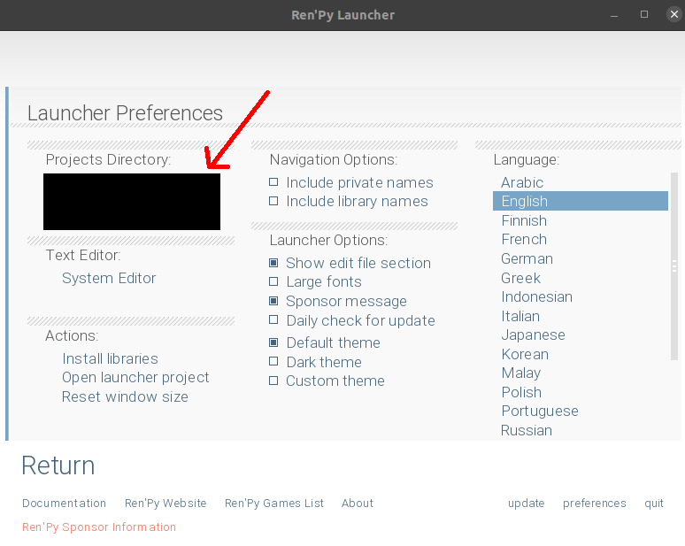

# renpy-space-invaders

A space invaders game that is embedded in renpy

## Getting Started

- Place the `space_invaders` directory in your projects directory for renpy.

To find/change your renpy project directory

1. Click preferences in your renpy launcher

2. The path should be in the top left. You can also change it.

